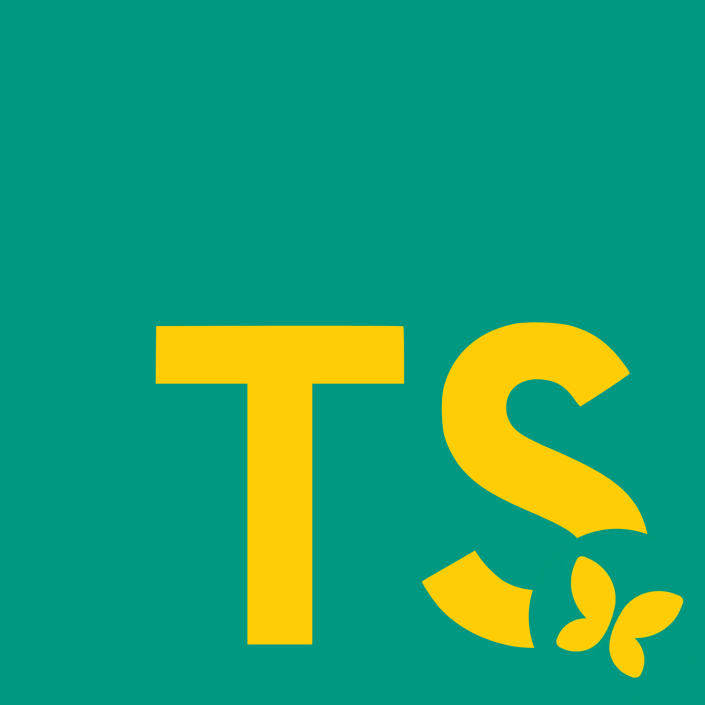

<p align="center">
  
</p>

<h1 align="center">pronoteTs</h1>

<p align="center">
  Full TypeScript port of <a href="https://github.com/bain3/pronotepy">pronotepy</a> - an unofficial PRONOTE API client.<br>
  Same protocol, same encryption (RSA-1024 + AES-128-CBC), same data model, same ENT/SSO providers. Built for Node.js ≥ 18.14 (requires native <code>fetch</code> with <code>Headers.getSetCookie()</code>).
</p>

<p align="center">
  See the <a href="https://pyronixus.github.io/pronoteTs">Multilingual (10+) project page</a> for a visual overview.
</p>

## Why TypeScript?

If you are building a modern web service, backend API, or bot, **pronoteTs** brings PRONOTE integration natively into the JavaScript / TypeScript ecosystem:

- **End-to-End Type Safety & DX**: Enjoy autocompletion, instant inline documentation, and compile-time checks for all PRONOTE models (`Grade`, `Homework`, `Absence`, etc.) directly in VS Code or your IDE. No more guessing dictionary keys or handling unexpected runtime types.
- **Async Native & Non-Blocking**: Built from the ground up around `Promise` and `async/await`. Unlike Python's `requests`-based blocking I/O, `pronoteTs` integrates seamlessly into modern asynchronous runtimes like **Node.js**, **Express**, **Fastify**, **NestJS**, or **Elysia** without blocking the event loop or needing complex thread pools.
- **Modern JavaScript Standard**: Uses native Web APIs like `fetch` and modern standard library features, ensuring high performance, low overhead, and easy integration with modern Node.js environments (≥ 18.14).
- **Single Language Ecosystem**: Avoid maintaining a Python microservice just to interact with PRONOTE when your primary application stack is written in TypeScript, Next.js, or React Native.

## Install

```bash
npm install pronotets
```

## Quick start

```ts
import { Client } from "pronoteTs";

const client = await Client.login(
  "https://TOWN.pronote.MYACADEMY.fr/pronote/eleve.html",
  "username",
  "password"
);

console.log(client.info.name);

const period = client.periods[0];
for (const grade of await period.grades()) {
  console.log(`${grade.subject.name}: ${grade.grade}/${grade.outOf}`);
}

for (const hw of await client.homework(new Date())) {
  console.log(hw.description);
}
```

## Logging in through an ENT

```ts
import { Client } from "pronoteTs";
import * as ent from "pronoteTs/ent";

const client = await Client.login(
  "https://TOWN.pronote.MYACADEMY.fr/pronote/eleve.html?login=true",
  "ent_username",
  "ent_password",
  { ent: ent.acRennes } // or ent.valDeMarne, ent.entHdf, ent.ileDeFrance, etc.
);
```

Every ENT provider from pronotepy is ported in `src/ent/ent.ts` (CAS, CAS+EduConnect, Open ENT NG, Open ENT NG+EduConnect, WAYF, HubEduConnect, Oze ENT, plain login forms, and the bespoke `ac_rennes`/Toutatice flow). The generic building blocks (`cas`, `casEdu`, `educonnect`, `openEntNg`, `wayf`, ...) are also exported so you can wire up an unlisted ENT yourself.

## QR code / token login

```ts
import { Client } from "pronoteTs";

const qrData = { login: "...", jeton: "...", url: "..." }; // scanned from the PRONOTE mobile app
const client = await Client.qrcodeLogin(qrData, "1234", crypto.randomUUID());

// Refresh later without re-scanning:
const creds = client.exportCredentials();
const client2 = await Client.tokenLogin(creds.pronoteUrl, creds.username, creds.password, creds.uuid);
```

## Parent / school-staff accounts

```ts
import { ParentClient, VieScolaireClient } from "pronoteTs";

const parent = await ParentClient.login(url, username, password);
console.log(parent.children.map((c) => c.name));
parent.setChild("Child Name");

const staff = await VieScolaireClient.login(url, username, password);
for (const klass of staff.classes) {
  console.log(klass.name, await klass.students());
}
```

## What's covered

- **Cryptography**: `Encryption` (RSA-1024 PKCS#1 v1.5 for the handshake, AES-128-CBC for the session), faithful to `pronoteAPI._Encryption`.
- **Communication**: raw zlib compression, request/response encryption, PRONOTE error handling, automatic keep-alive (`client.keepAlive()`).
- **Authentication**: password, ENT (cookie-based), QR code, persistent token, two-factor auth (PIN + device registration).
- **Data model** (`src/dataClasses.ts`): `Grade`, `Average`, `Period`, `Report`, `Absence`, `Delay`, `Punishment`, `Lesson`, `LessonContent`, `Homework`, `Attachment`, `Information`, `Discussion`, `Message`, `Recipient`, `ClientInfo`, `Student`, `Guardian`, `Identity`, `StudentClass`, `Menu`, `TeachingStaff`, `Acquisition`, `Evaluation`.
- **Clients**: `Client` (student), `ParentClient`, `VieScolaireClient`, all derived from `ClientBase`.
- **ENT**: 30+ preconfigured institutions/providers plus every reusable generic function.

Examples of supported ENT providers include Toutatice/ac-Rennes, Val-de-Marne, Île-de-France, ENT HDF, Kosmos, e-lyco, Auvergne-Rhône-Alpes, Mon Bureau Numérique, Occitanie, Lycée Connecté and Agora06. Custom providers can also be wired from the exported generic functions.

## Deliberate differences from pronotepy (Python)

- Fully asynchronous API (`Promise`/`async`/`await`) instead of blocking synchronous HTTP calls - `Client.login(...)` replaces `pronotepy.Client(...)`.
- Cookies handled via [`tough-cookie`](https://www.npmjs.com/package/tough-cookie) rather than `requests.Session`.
- End-to-end strict TypeScript typing (instead of Python duck-typing): autocompletion and compile-time checks across every data class.
- `client.keepAlive()` returns a `{ start(), stop() }` controller instead of a Python context manager.

## Build

```bash
npm run build     # compile src/ -> dist/
npm run example   # run assets/examples/example.ts with tsx
```

## Disclaimer

Unofficial project, not affiliated with Index Éducation. Use it in accordance with your school's terms of service.
